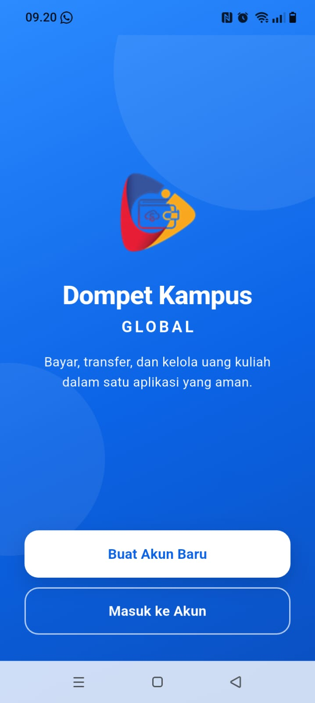
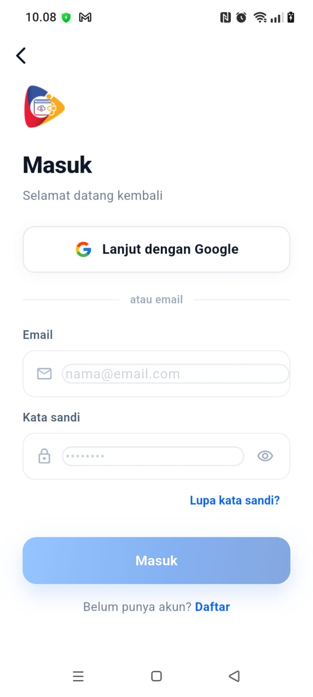
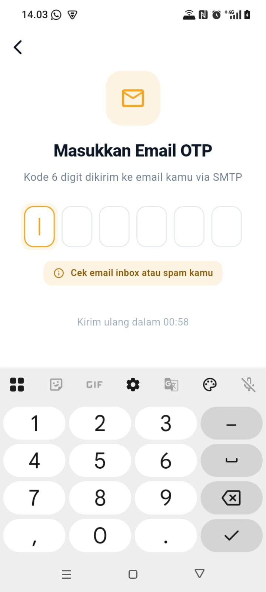
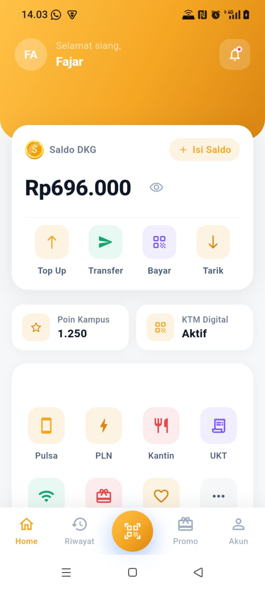
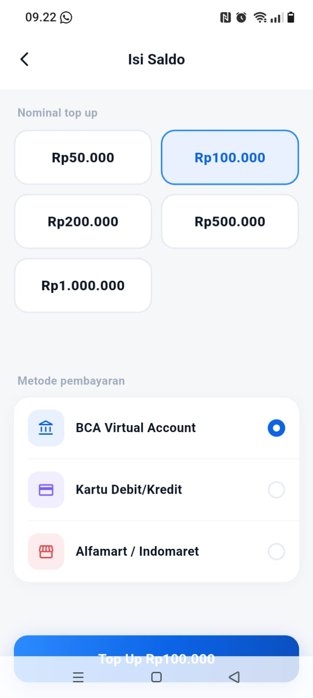
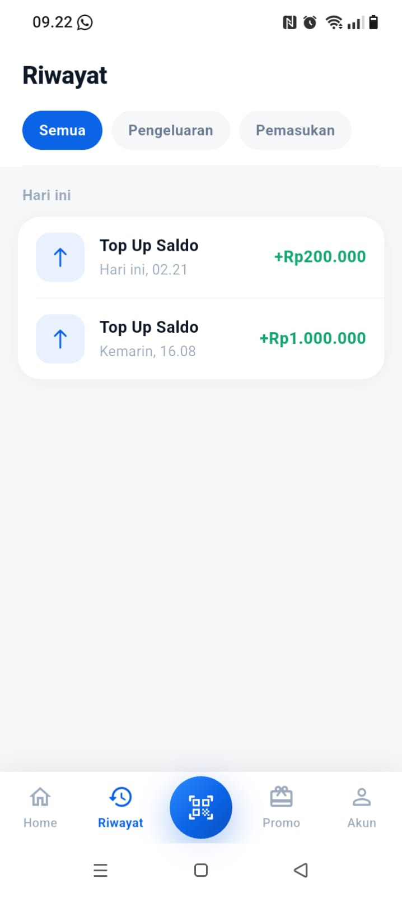
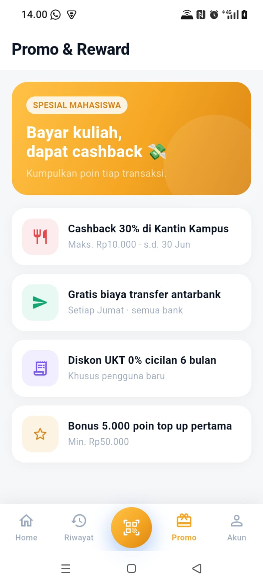
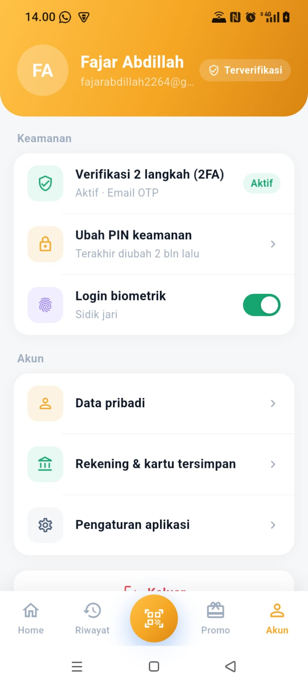

# 📱 Dompet Kampus Global — Aplikasi E-Money Ekosistem Kampus

Dompet Kampus Global adalah platform *e-money* terintegrasi yang dirancang khusus untuk mendigitalisasi seluruh ekosistem transaksi finansial di lingkungan area Kampus Global. Aplikasi ini mempermudah civitas akademika dalam melakukan pembayaran kuliah, transfer dana antarmahasiswa, hingga transaksi harian di kantin kampus secara cepat, aman, dan *cashless*.

---

## 📌 Deskripsi Aplikasi

Aplikasi ini hadir sebagai solusi finansial internal kampus yang menghubungkan mahasiswa, dosen, pihak administrasi, dan *merchant* (kantin/toko kampus). Dikembangkan menggunakan **Flutter** pada sisi *frontend* untuk performa *cross-platform* yang mulus, serta didukung oleh **Golang (Gin Framework)** pada sisi *backend* untuk pemrosesan data performa tinggi yang ringan dan aman.

### 🌟 Fitur Utama & Keunggulan
* **Smart Payment & Billing**: Pembayaran uang kuliah (UKT) dan biaya administrasi kampus langsung dari aplikasi.
* **Instant Transfer & Request Funds**: Kirim dan minta saldo antar-mahasiswa instan tanpa biaya admin.
* **Kantin Digital (Jajan Skuy)**: Integrasi transaksi QR Code di kantin kampus untuk memesan makanan dan minuman tanpa antre.
* **Notifikasi Real-Time**: Push notification instan via Firebase Cloud Messaging untuk setiap aktivitas masuk dan keluar saldo.
* **Biometric & Secure Storage**: Keamanan ekstra dengan penyimpanan data lokal terenkripsi untuk sesi pengguna.

---

## 🏗️ Arsitektur Aplikasi (Frontend)

Proyek frontend ini mengimplementasikan **Clean Architecture** yang dikombinasikan dengan state management **BLoC**. Struktur ini memisahkan kode menjadi lapisan yang jelas (*Separation of Concerns*) sehingga sangat mudah diuji (*testable*) dan dikembangkan oleh tim.

```text
lib/
├── core/
│   ├── constants/      # Variabel global tetap (Base URL, string, dll)
│   ├── error/          # Penanganan error global & exceptions
│   ├── network/        # Konfigurasi client HTTP (Dio, interceptors)
│   ├── router/         # Manajemen navigasi dan deep links (GoRouter)
│   ├── services/       # Layanan sistem eksternal
│   ├── theme/          # Konfigurasi style UI, warna, dan tipografi
│   └── utils/          # Fungsi pembantu (helper functions)
├── data/
│   ├── datasources/    # Sumber data mentah
│   │   ├── local/      # Akses penyimpanan lokal (Secure Storage, Prefs)
│   │   └── remote/     # Akses ke API backend
│   ├── models/         # Parsing data JSON ke objek dan sebaliknya
│   └── repositories/   # Implementasi konkret dari kontrak repositori
├── domain/
│   ├── entities/       # Bisnis objek inti aplikasi (pure Dart)
│   ├── repositories/   # Kontrak interface untuk lapisan data
│   └── usecases/       # Logika bisnis spesifik per alur fitur
├── injection/          # Dependency Injection setup (GetIt)
└── presentation/       # Lapisan Antarmuka Pengguna (UI)
    ├── blocs/          # Manajemen status aplikasi (State Management)
    ├── pages/          # Layanan halaman layar penuh (Screens)
    └── widgets/        # Komponen UI kecil yang dapat digunakan kembali
```
---

## 🏗️ Arsitektur Aplikasi (Backend)

Proyek backend Dompet Kampus Global ini mengimplementasikan pola arsitektur **Layered Architecture** standar yang memisahkan tanggung jawab setiap komponen kode (*Separation of Concerns*). Pemisahan ini memastikan alur data finansial berjalan secara aman, terisolasi, dan mudah untuk dilakukan pelacakan ketika terjadi kesalahan sistem.

```text
.
├── config/             # Konfigurasi aplikasi (seperti inisialisasi env load atau sistem eksternal)
├── database/           # Pengaturan koneksi database MySQL, konfigurasi ORM, dan migrasi skema
├── handlers/           # Lapisan Controller / HTTP handler untuk memproses request & response API
├── middleware/         # Fungsi penengah global (seperti autentikasi JWT token, CORS, dan recovery)
├── models/             # Struktur data (struct) entitas bisnis dan representasi tabel database
├── postman/            # Kumpulan file JSON koleksi API Postman untuk kebutuhan dokumentasi & testing
├── routes/             # Tempat pendaftaran dan manajemen definisi endpoint API (Routing Gin)
├── services/           # Lapisan logika bisnis inti aplikasi (Business Logic Layer)
├── .env                # Berkas konfigurasi rahasia berisi variabel lingkungan lokal
├── .gitignore          # Daftar file/folder yang diabaikan dan tidak akan di-push ke repositori Git
├── dompetkampusglobal.json # Berkas kredensial Firebase Service Account untuk fitur Firebase Admin SDK
├── go.mod              # Berkas manajer dependensi utama untuk modul ekosistem Go
├── go.sum              # Catatan penguncian checksum versi modul dependensi Go agar tetap konsisten
└── main.go             # Titik masuk utama (Entry Point) untuk menjalankan server backend e-money
```

---

## 🔗 Link Repositori Ekosistem

Seluruh ekosistem Dompet Kampus Global dan platform kantin pendukungnya terbagi dalam repositori berikut:

* **Backend Dompet Kampus Global:** [GitHub - BE Dompet Kampus Global](https://github.com/AbdillahFajar/dompetkampusglobal-be)
* **Frontend Jajan Skuy (Kantin):** [GitHub - FE Jajan Skuy](https://github.com/AbdillahFajar/jajanskuy)
* **Backend Jajan Skuy (Kantin):** [GitHub - BE Jajan Skuy](https://github.com/AbdillahFajar/jajanskuy-be)

---

## 🚀 Cara Menjalankan Proyek

### 1. Kloning Repositori
```bash
# Clone Frontend
git clone https://github.com/AbdillahFajar/globalemoney

# Clone Backend
git clone https://github.com/AbdillahFajar/dompetkampusglobal-be
```

### 2. Menjalankan Backend (BE)
Buat file `.env` di direktori root backend dan isi konfigurasi berikut:
```env
APP_PORT=8081
DB_HOST=
DB_PORT=
DB_USER=
DB_PASSWORD=
DB_NAME=
REDIS_HOST=
REDIS_PORT=
REDIS_PASSWORD=
JWT_SECRET_KEY=
JWT_EXPIRATION=
FIREBASE_CREDENTIALS_PATH=
SMTP_HOST=
SMTP_PORT=
SMTP_USER=
SMTP_PASSWORD=
SMTP_FROM=
SMTP_FROM_NAME=
OTP_EXPIRY_MINUTES=
```
Eksekusi infrastruktur dan jalankan server:
```bash
# 1. Buat database & user database sesuai dengan isi file .env Anda
Buat file `.env` di direktori root backend dan isi konfigurasi sesuai kebutuhan server lokal Anda.

# 2. Menjalankan Backend (BE)
Eksekusi infrastruktur dan jalankan server menggunakan kontrol panel database lokal (XAMPP / Laragon / phpMyAdmin):
    1. **Jalankan Layanan MySQL & Redis:**
    * Buka aplikasi kontrol panel Anda (contoh: **XAMPP** atau **Laragon**).
    * Klik tombol **Start** pada layanan **Apache** dan **MySQL**.
    * Jalankan perintah docker run --name redis-cache -d -p 6379:6379 redis di CMD komputer atau laptop Anda untuk menjalankan layanan **Redis** lokal Anda di latar belakang (*background*) menggunakan docker.

    2. **Konfigurasi Database via phpMyAdmin:**
    * Buka browser dan masuk ke URL: `http://localhost/phpmyadmin`
    * Buat database baru dengan nama yang disesuaikan dengan variabel `DB_NAME` pada file `.env` Anda.
    * Buat user database baru atau gunakan user bawaan (`root` tanpa password) sesuai dengan konfigurasi file `.env`.

    3. **Jalankan Server Backend:**
    Buka terminal di direktori proyek backend, lalu ketik perintah:
    ```bash
    go run main.go
   ```

### 3. Menjalankan Frontend (FE)
```bash
# 1. Ambil semua dependensi proyek
flutter pub get

# 2. Cek IP Address Wi-Fi komputer Anda lewat terminal
ipconfig

# 3. Buka file `lib/core/constants/api_constants.dart` 
#    dan perbarui `baseUrl` sesuai dengan IP Address Wi-Fi di atas.

# 4. Hubungkan HP menggunakan kabel data (Aktifkan Developer Mode & USB Debugging)

# 5. Jalankan perintah ADB port forwarding untuk menjamin konektivitas lokal
adb reverse tcp:8081 tcp:8081
adb devices

# 6. Jalankan proyek melalui tab 'Run and Debug' di VS Code atau terminal:
flutter run
```

---

## 📦 Daftar Dependensi Utama

Berikut adalah pustaka utama yang digunakan dalam proyek ini berdasarkan berkas `pubspec.yaml`:

| Kategori | Package | Versi | Deskripsi |
|---|---|---|---|
| **State Management** | `flutter_bloc` | `^9.0.0` | Mengatur alur status data aplikasi |
| | `equatable` | `^2.0.5` | Pembandingan objek tanpa override operator `==` |
| **Dependency Injection** | `get_it` | `^8.0.2` | Service locator untuk manajemen instansi kelas |
| **Navigation** | `go_router` | `^14.8.1` | Deklaratif routing dan penanganan deep links |
| **Network** | `dio` | `^5.7.0` | HTTP Client tangguh untuk komunikasi ke REST API |
| | `pretty_dio_logger` | `^1.4.0` | Logging visual request & response API di terminal |
| **URL Launcher** | `url_launcher` | `^6.3.2` | Membuka link eksternal web browser pihak ketiga |
| **Deep Links** | `app_links` | `^7.1.2` | Handler HTTPS App Links untuk Android & iOS |
| **Firebase** | `firebase_core` | `^3.12.1` | Inisialisasi utama ekosistem Firebase |
| | `firebase_auth` | `^5.5.2` | Autentikasi keamanan pengguna |
| | `firebase_messaging` | `^15.2.4` | Penerima real-time Push Notification |
| | `google_sign_in` | `^6.2.2` | Layanan integrasi Google OAuth Login |
| **Local Storage** | `flutter_secure_storage` | `^9.2.2` | Enkripsi penyimpanan data sensitif lokal (Token/Pin) |
| | `shared_preferences` | `^2.3.4` | Penyimpanan data lokal tipe *key-value* sederhana |
| **QR / Camera** | `mobile_scanner` | `^7.0.0` | Pemindai QR Code super cepat untuk transaksi kantin |
| **UI Helpers** | `cached_network_image` | `^3.4.1` | Manajemen memori cache gambar online |
| | `shimmer` | `^3.0.0` | Efek loading animasi modern placeholder |
| | `intl` | `^0.19.0` | Pemformatan mata uang Rupiah dan tanggal lokal |
| **Icons** | `cupertino_icons` | `^1.0.8` | Aset ikon standar bawaan iOS style |
| | `flutter_launcher_icons`| `^0.14.4` | Generator otomatis ikon aplikasi smartphone |

### 🛠️ Spesifikasi Kebutuhan Lingkungan Android
Berdasarkan target spesifikasi SDK Flutter (`>=3.0.0 <4.0.0`), berikut adalah kompatibilitas standar perangkat Android yang didukung:
* **Minimum Android SDK (minSdkVersion):** `21` (Android 5.0 Lollipop atau di atasnya) agar menjamin pustaka kamera, Firebase, dan enkripsi lokal berjalan stabil.
* **Target Android SDK (targetSdkVersion):** `34` (Android 14) untuk standar kepatuhan regulasi privasi Google Play Store terbaru.

---

## 📸 Screenshot Aplikasi

Berikut adalah tampilan antarmuka pengguna (UI) dari aplikasi **Dompet Kampus Global**:

### 🔐 Autentikasi & Keamanan

| Splash Page | Login Page | 2FA SMTP Page |
| :---: | :---: | :---: |
|  |  |  |

### 💳 Beranda & Fitur Finansial

| Homepage | Top Up Page | History Page |
| :---: | :---: | :---: |
|  |  |  |

### 🎁 Informasi & Profil

| Promo Page | Account Page |
| :---: | :---: |
|  |  |

---

## 🎥 Link Video Presentasi

**[Implementasi Deeplink pada Aplikasi E-Commerce dan E-Money](https://youtu.be/6snwAnRGqAY?si=dTJ8qCzCjaxD8mPs)**
